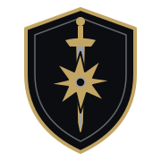

  <picture>
    <source media="(prefers-color-scheme: dark)" srcset="./assets/sigil-dark.svg">
    
  </picture>

<h1 align="center">ARTIFEX IGNOTVS</h1>

<strong>OFFICINA IGNOTA · THE UNKNOWN WORKSHOP</strong>

  <strong>EX SILENTIO, SIGNA.</strong> 
  <em>From silence, signals.</em>

Defensive intelligence tools for exposed systems, hidden signals, and authorized research — local-first where possible.

## PRINCIPIA

- Explicit authorization.
- Local processing and data minimization where practical.
- Inspectable methods and reproducible evidence.
- Defensive outcomes over spectacle.

## IN OFFICINA

CLAVIS is currently in private alpha and is not publicly available.
